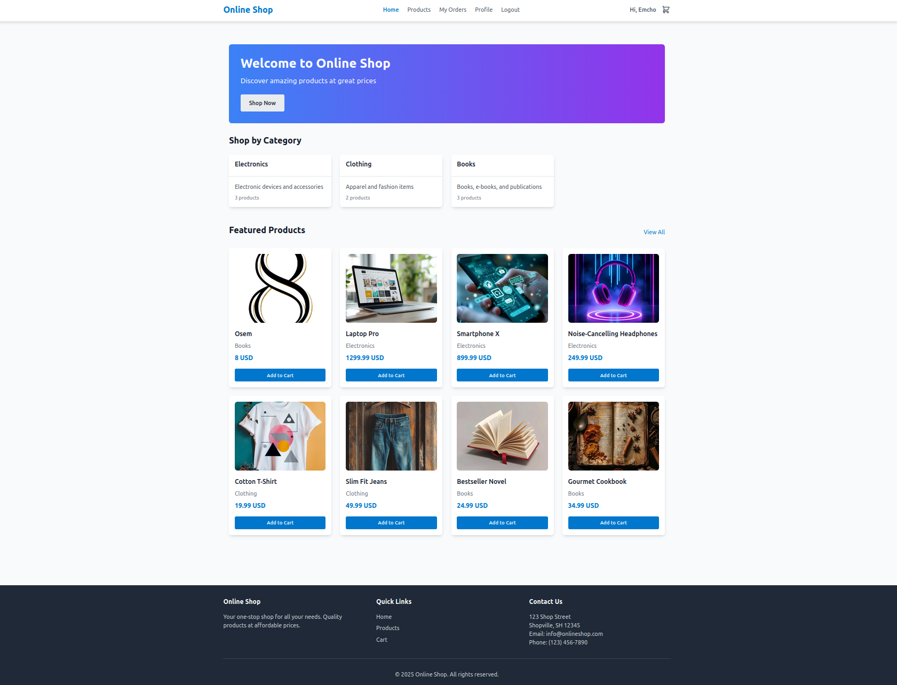

# Spring React Docker Shop

Full-stack demo online shop built with **Spring Boot, React, MySQL and Docker Compose**.



## Table of Contents

- [Project Structure](#project-structure)
- [Features](#features)
- [Getting Started](#getting-started)
  - [Prerequisites](#prerequisites)
  - [Environment Configuration](#environment-configuration)
  - [Running the Application](#running-the-application)
  - [Demo Users](#demo-users)
- [Local Development](#local-development)
  - [Backend Development](#backend-development)
  - [Frontend Development](#frontend-development)
- [Debugging](#debugging)
  - [Debugging Docker Containers](#debugging-docker-containers)
  - [Frontend Debugging](#frontend-debugging)
  - [Backend Debugging](#backend-debugging)
  - [Troubleshooting](#troubleshooting)
- [Next Steps](#next-steps)
- [License](#license)

## Project Structure

```
online-shop/
├── backend/                  # Spring Boot application
│   ├── src/                  # Source code
│   │   ├── main/
│   │   │   ├── java/com/shop/
│   │   │   │   ├── config/   # Configuration classes
│   │   │   │   ├── controller/ # REST controllers
│   │   │   │   ├── model/    # Entity classes
│   │   │   │   ├── repository/ # Data repositories
│   │   │   │   ├── service/  # Business logic
│   │   │   │   └── OnlineShopApplication.java # Main class
│   │   │   └── resources/    # Application resources
│   │   │       ├── db/migration/ # Flyway migrations
│   │   │       └── application.properties # App configuration
│   │   └── test/             # Test code
│   ├── pom.xml               # Maven dependencies
│   └── Dockerfile            # Backend Docker configuration
├── frontend/                 # React application
│   ├── src/                  # Source code
│   │   ├── App.tsx           # Main React component
│   │   ├── main.tsx          # Entry point
│   │   └── ...               # Other components and assets
│   ├── index.html            # HTML template
│   ├── package.json          # NPM dependencies
│   ├── tsconfig.json         # TypeScript configuration
│   ├── vite.config.ts        # Vite configuration
│   ├── Dockerfile            # Frontend Docker configuration
│   └── nginx.conf            # Nginx configuration
├── docker-compose.yml        # Docker Compose configuration
└── README.md                 # Project documentation
```

## Features

- **Backend**:
  - Spring Boot with Java
  - Spring Data JPA for database access
  - Spring Security with JWT authentication
  - MySQL database with automatic initialization
  - Flyway for database migrations

- **Frontend**:
  - React with TypeScript
  - Vite for fast development and building
  - Responsive design

- **Infrastructure**:
  - Docker containers for all components
  - Docker Compose for orchestration

## Getting Started

### Prerequisites

- Docker and Docker Compose
- Java 17 (for local development)
- Node.js 18+ (for local development)
- MySQL (the database will be created automatically)

### Environment Configuration

The application uses environment variables for configuration, especially in Docker environments:

- **Database Configuration**:
  - `SPRING_DATASOURCE_URL`: JDBC URL for the database connection
  - `SPRING_DATASOURCE_USERNAME`: Database username
  - `SPRING_DATASOURCE_PASSWORD`: Database password

These variables are set in the `docker-compose.yml` file for Docker environments. For local development, default values are provided in `application.properties`.

### Running the Application

1. Clone the repository
2. Navigate to the project root directory
3. Run the application using Docker Compose:

```bash
docker compose up -d
```

4. Access the application:
   - Frontend: http://localhost:8082
   - Backend API: http://localhost:8080/api
   - Health check: http://localhost:8080/api/health

### Demo Users

The application comes with a set of predefined demo users for testing authentication and authorization.

> ⚠️ These accounts are for **development/demo purposes only**.  
> Do not reuse these passwords in any real environment.

| Role        | Username / Email        | Password      | Notes                     |
|------------|-------------------------|---------------|---------------------------|
| Admin      | `admin@example.com`     | `password`    | Full access to admin UI   |
| User       | `user@example.com`      | `password`     | Regular customer account  |

You can log in with these credentials from the frontend login page.


## Local Development

For local development, you'll need to run the Docker containers first to have the database available, then run the backend and frontend separately.

### Backend Development

#### Running the Backend Locally

1. Start the Docker containers for the database:
```bash
docker compose up -d db
```

2. Run the Spring Boot application:
```bash
cd backend
#export JAVA_HOME=/home/sunny/.jdks/corretto-21
#export PATH="$JAVA_HOME/bin:$PATH"
# Using Maven (if installed)
mvn spring-boot:run
# Or using Maven Wrapper (no Maven installation required)
./mvnw spring-boot:run
```

#### Running the Backend Demo - using H2 
For the public demo, the backend can run with an in-memory H2 database:
- Profile: `h2`
- DB: `jdbc:h2:mem:shopdb`
- Flyway: disabled
- Schema: generated by Hibernate
- Sample users: see [Demo Users](#demo-users)

```bash
cd backend
#export JAVA_HOME=/home/sunny/.jdks/corretto-21.0.7/
#export PATH="$JAVA_HOME/bin:$PATH"
# Using Maven (if installed)
mvn mvn spring-boot:run -Dspring-boot.run.profiles=h2
# Or using Maven Wrapper (no Maven installation required)
./mvnw mvn spring-boot:run -Dspring-boot.run.profiles=h2

#  SPRING_PROFILES_ACTIVE=h2 mvn spring-boot:run
#  java -jar app.jar --spring.profiles.active=h2
```

4. Access the application:
    - Frontend: http://localhost:3000
    - Backend API: http://localhost:8081/api
    - Health check: http://localhost:8081/api/health
    - H2 console: http://localhost:8081/api/health
    - (JDBC URL: jdbc:h2:mem:shopdb, user: sa, password: empty)

#### Database Configuration

The application is configured to connect to the MySQL database running in Docker with the following settings:

- URL: jdbc:mysql://localhost:3307/online_shop
- Username: shop_user
- Password: shop_password

These settings match the configuration in the `docker-compose.yml` file, where the MySQL container exposes port 3307 on the host machine.

#### Backend Troubleshooting

If you encounter database connection issues, make sure:

1. The Docker containers are running:
   ```bash
   docker compose ps
   ```

2. The MySQL container is healthy:
   ```bash
   docker compose logs db
   ```

3. You can connect to the MySQL database using a client:
   ```bash
   mysql -h localhost -P 3307 -u shop_user -p
   ```
   When prompted, enter the password: `shop_password`

### Frontend Development

```bash
cd frontend
npm install
npm run dev
```

## Debugging

### Debugging Docker Containers

This section provides instructions on how to use the debugging capabilities added to the Docker containers for the online shop application.

#### Overview of Changes

The following changes have been made to enable debugging in the Docker containers:

##### Frontend (React/Nginx)

1. **Dockerfile Changes**:
   - Enabled source map generation
   - Copied source code to the container for better debugging
   - Added debug logging to Nginx

2. **docker-compose.yml Changes**:
   - Set environment variables for development mode
   - Exposed LiveReload port (35729)
   - Mounted source code and Nginx logs directories as volumes

##### Backend (Spring Boot/Java)

1. **Dockerfile Changes**:
   - Added verbose logging during Maven build
   - Copied source code to the container for better debugging
   - Exposed remote debugging port (5005)
   - Added JVM arguments for remote debugging and verbose logging

2. **docker-compose.yml Changes**:
   - Added environment variables for logging and debugging
   - Exposed remote debugging port (5005)
   - Mounted source code directory as a volume for live debugging

### Frontend Debugging

1. **Accessing Nginx Logs**:
   - Logs are available in the `frontend/nginx/logs` directory
   - You can also view logs directly from the container:
     ```bash
     docker logs online-shop-frontend
     ```

2. **Using Source Maps**:
   - Source maps are enabled in the build process
   - When viewing errors in the browser console, you'll see references to the original source files
   - The source code is mounted at `/usr/share/nginx/html/src` in the container

3. **LiveReload**:
   - Port 35729 is exposed for LiveReload
   - Changes to the source code will be reflected in the browser automatically

### Backend Debugging

1. **Remote Debugging with IDE**:
   - Connect your IDE to port 5005 on localhost
   - For IntelliJ IDEA:
     1. Go to Run > Edit Configurations
     2. Add a new Remote JVM Debug configuration
     3. Set the host to localhost and the port to 5005
     4. Start the debug session

2. **Viewing Logs**:
   - Logs are available in the container's stdout/stderr
   - You can view them with:
     ```bash
     docker logs online-shop-backend
     ```

3. **Heap Dumps**:
   - If the application runs out of memory, a heap dump will be generated in the `/tmp` directory of the container
   - You can copy it to your local machine with:
     ```bash
     docker cp online-shop-backend:/tmp/java_pid1.hprof ./
     ```

### Troubleshooting

#### Frontend Issues

- If you don't see source maps in the browser console, make sure the browser's developer tools are configured to use source maps
- If LiveReload isn't working, check that port 35729 is not blocked by a firewall

#### Backend Issues

- If you can't connect to the remote debugger, make sure port 5005 is not blocked by a firewall
- If the application seems to hang on startup, check if the debugger is set to suspend on startup (it shouldn't be with the current configuration)

#### Additional Resources

- [Remote Debugging Java Applications](https://www.jetbrains.com/help/idea/tutorial-remote-debug.html)
- [Debugging React Applications](https://reactjs.org/docs/debugging-tools.html)
- [Nginx Debugging](https://docs.nginx.com/nginx/admin-guide/monitoring/debugging/)

## Next Steps

This is a skeleton project with minimal functionality. Next steps for development:

1. Implement payment integration
2. Enhance UI with better styling and user experience

## License

© 2025 Soft Protect Ltd. All rights reserved.

This repository is provided for demonstration and portfolio purposes only.  
Unauthorised copying, modification or redistribution is not permitted.

Maintained by Sunny Dineva (Soft Protect Ltd.).
