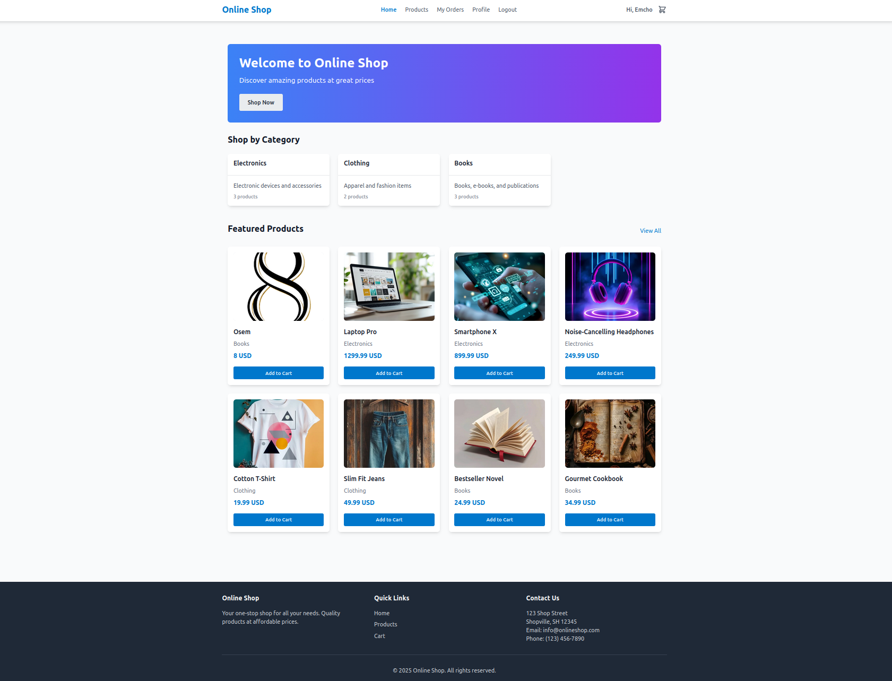

# Spring React Docker Shop

Full-stack demo online shop built with **Spring Boot, React, MySQL and Docker Compose**.



## Table of Contents

- [Project Structure](#project-structure)
- [Features](#features)
- [Getting Started](#getting-started)
  - [Prerequisites](#prerequisites)
  - [Environment Configuration](#environment-configuration)
  - [Running the Application](#running-the-application)
  - [Demo Users](#demo-users)
- [Local Development](#local-development)
  - [Backend Development](#backend-development)
  - [Frontend Development](#frontend-development)
- [Debugging](#debugging)
  - [Debugging Docker Containers](#debugging-docker-containers)
  - [Frontend Debugging](#frontend-debugging)
  - [Backend Debugging](#backend-debugging)
  - [Troubleshooting](#troubleshooting)
- [Next Steps](#next-steps)
- [License](#license)

## Project Structure

```
online-shop/
├── backend/                  # Spring Boot application
│   ├── src/                  # Source code
│   │   ├── main/
│   │   │   ├── java/com/shop/
│   │   │   │   ├── config/   # Configuration classes
│   │   │   │   ├── controller/ # REST controllers
│   │   │   │   ├── model/    # Entity classes
│   │   │   │   ├── repository/ # Data repositories
│   │   │   │   ├── service/  # Business logic
│   │   │   │   └── OnlineShopApplication.java # Main class
│   │   │   └── resources/    # Application resources
│   │   │       ├── db/migration/ # Flyway migrations
│   │   │       └── application.properties # App configuration
│   │   └── test/             # Test code
│   ├── pom.xml               # Maven dependencies
│   └── Dockerfile            # Backend Docker configuration
├── ai-service/              # AI microservice (product description & content generation)
├── category-service/        # Extracted from backend (product categories management)
├── email-service/           # Sends emails on order events (Kafka consumer)
├── frontend/                 # React application
│   ├── src/                  # Source code
│   │   ├── App.tsx           # Main React component
│   │   ├── main.tsx          # Entry point
│   │   └── ...               # Other components and assets
│   ├── index.html            # HTML template
│   ├── package.json          # NPM dependencies
│   ├── tsconfig.json         # TypeScript configuration
│   ├── vite.config.ts        # Vite configuration
│   ├── Dockerfile            # Frontend Docker configuration
│   └── nginx.conf            # Nginx configuration
├── docker-compose.yml        # Docker Compose configuration
└── README.md                 # Project documentation
```

## Features

- **Backend**:
  - Spring Boot with Java
  - Spring Data JPA for database access
  - Spring Security with JWT authentication
  - MySQL database with automatic initialization
  - Flyway for database migrations
  - - **Kafka integration for publishing order events (`order-events` topic)**

- **Frontend**:
  - React with TypeScript
  - Vite for fast development and building
  - Responsive design

- **Infrastructure**:
  - Docker containers for all components
  - Docker Compose for orchestration
  - **Local Kafka + Zookeeper setup for event-driven communication**

### Architecture Vision

The system is evolving from a modular monolith into a microservices-based architecture, with clear separation of concerns between services.

It demonstrates key patterns such as service decomposition, event-driven communication (Kafka), and AI integration as an isolated domain service, with the backend acting as an orchestration layer between services.

```text
React Frontend (Admin UI / Shop UI)
        |
        |  REST (/api/*)
        v
Shop Backend (Spring Boot)  — BFF / Orchestrator
        |
        |  REST (sync)
        +-------------------------> ai-service (Spring Boot) ------> OpenAI API
        |
        +-------------------------> category-service (Spring Boot)
        |
        |  Kafka (async events)
        +-------------------------> Kafka Broker
                                     |
                                     v
                              email-service (Spring Boot)
                                     |
                                     v
                               MailHog / SMTP
```
## Getting Started

### Prerequisites

- Docker and Docker Compose
- Java 17 (for local development)
- Node.js 18+ (for local development)
- MySQL (the database will be created automatically)


### Setting up Environment Variables

1. **Copy the example environment file**:
   ```bash
   cp .env.example .env
   ```

2. **Edit the `.env` file** with your actual values:
   ```bash
   # Edit with your preferred editor
   nano .env
   # or
   vim .env
   ```

3. **Required Variables**:
   - `OPENAI_API_KEY`: Your OpenAI API key for AI service functionality
   - `MYSQL_ROOT_PASSWORD`: MySQL root password
   - `MYSQL_PASSWORD`: Password for the main database user
   - `CATEGORY_MYSQL_PASSWORD`: Password for the category service database user

#### Environment Variables Reference

- **Database Configuration**:
  - `MYSQL_ROOT_PASSWORD`: MySQL root password
  - `MYSQL_DATABASE`: Main database name (default: online_shop)
  - `MYSQL_USER`: Main database username (default: shop_user)
  - `MYSQL_PASSWORD`: Main database password
  - `CATEGORY_MYSQL_DATABASE`: Category service database name (default: category_service)
  - `CATEGORY_MYSQL_USER`: Category service database username
  - `CATEGORY_MYSQL_PASSWORD`: Category service database password
  - `SPRING_DATASOURCE_USERNAME`: Spring datasource username for main service
  - `SPRING_DATASOURCE_PASSWORD`: Spring datasource password for main service
  - `CATEGORY_SPRING_DATASOURCE_USERNAME`: Spring datasource username for category service
  - `CATEGORY_SPRING_DATASOURCE_PASSWORD`: Spring datasource password for category service

- **AI Service Configuration**:
  - `OPENAI_API_KEY`: Your OpenAI API key for product description and social post generation

- **Security Configuration** (Optional):
  - `JWT_SECRET`: JWT secret key for token signing (for production environments)

- **Email Configuration** (Optional):
  - `SPRING_MAIL_USERNAME`: Email service username (leave empty for MailHog development setup)
  - `SPRING_MAIL_PASSWORD`: Email service password (leave empty for MailHog development setup)

> **Note**: The `.env` file is already included in `.gitignore` and will not be committed to version control. Always use the `.env.example` file as a template and never commit sensitive credentials.

### Running the Application

1. Clone the repository
2. Navigate to the project root directory
3. Run the application using Docker Compose:

```bash
docker compose up -d
```

### Demo Users

The application comes with a set of predefined demo users for testing authentication and authorization.

> ⚠️ These accounts are for **development/demo purposes only**.  
> Do not reuse these passwords in any real environment.

| Role        | Username / Email        | Password      | Notes                     |
|------------|-------------------------|---------------|---------------------------|
| Admin      | `admin@example.com`     | `password`    | Full access to admin UI   |
| User       | `user@example.com`      | `password`     | Regular customer account  |

You can log in with these credentials from the frontend login page.

### Service Ports

| Service           | URL                         | Description                      |
|------------------|-----------------------------|----------------------------------|
| frontend         | http://localhost:8083       | React UI                         |
| backend          | http://localhost:8081/api   | Main API (BFF)                   |
| category-service | http://localhost:8084/api   | Category API                     |
| ai-service       | http://localhost:8085/api   | AI API                           |
| email-service    | http://localhost:8082       | Email service (internal)         |
| mailhog          | http://localhost:8025       | Email testing UI                 |

## Local Development

For local development, you'll need to run the Docker containers first to have the database available, then run the backend and frontend separately.

### Backend Development

#### Running the Backend Locally

1. Start the Docker containers for the database:
```bash
./mvnw -DskipTests package
docker compose up -d db
```

2. Run the Spring Boot application:
```bash
cd backend
#export JAVA_HOME=/home/sunny/.jdks/corretto-21
#export PATH="$JAVA_HOME/bin:$PATH"
# Using Maven (if installed)
mvn spring-boot:run
# Or using Maven Wrapper (no Maven installation required)
./mvnw spring-boot:run
```

#### Database Configuration (Docker / MySQL)

The application is configured to connect to the MySQL database running in Docker with the following settings:

- URL: jdbc:mysql://localhost:3307/online_shop
- Username: shop_user
- Password: shop_password

These settings match the configuration in the `docker-compose.yml` file, where the MySQL container exposes port 3307 on the host machine.

#### In-memory H2 Database (demo profile)

For the public demo, the backend can run with an in-memory H2 database (no Docker/MySQL required):

- Profile: `h2`
- DB URL: `jdbc:h2:mem:shopdb`
- Flyway: disabled
- Schema: generated by Hibernate
- Sample users: see [Demo Users](#demo-users)

```bash
cd backend

# Using Maven (if installed)
mvn spring-boot:run -Dspring-boot.run.profiles=h2

# Or using Maven Wrapper (no Maven installation required)
./mvnw spring-boot:run -Dspring-boot.run.profiles=h2

# Alternative forms:
# SPRING_PROFILES_ACTIVE=h2 mvn spring-boot:run
# java -jar app.jar --spring.profiles.active=h2
```
### Frontend Development

```bash
cd frontend
npm install
npm run dev
```

## Debugging

### Frontend Debugging

1. **Accessing Nginx Logs**:
   - Logs are available in the `frontend/nginx/logs` directory
   - You can also view logs directly from the container:
     ```bash
     docker logs online-shop-frontend
     ```

2. **Using Source Maps**:
   - Source maps are enabled in the build process
   - When viewing errors in the browser console, you'll see references to the original source files
   - The source code is mounted at `/usr/share/nginx/html/src` in the container

3. **LiveReload**:
   - Port 35729 is exposed for LiveReload
   - Changes to the source code will be reflected in the browser automatically

### Backend Debugging

The application exposes remote debugging ports for each microservice. You can attach your IDE (e.g. IntelliJ IDEA) using **Remote JVM Debug**.

## Debug Ports

| Service           | Debug Port |
|------------------|-----------|
| backend          | 5005      |
| email-service    | 5006      |
| category-service | 5007      |
| ai-service       | 5008      |

#### How to connect (IntelliJ IDEA)

1. Go to **Run → Edit Configurations**
2. Click **+ → Remote JVM Debug**
3. Set:
    - Host: `localhost`
    - Port: `<debug-port-from-table>`
4. Start debugging

> ⚠️ Make sure the corresponding port is exposed in `docker-compose.yml`.


## Next Steps

This is a skeleton project with minimal functionality. Next steps for development:

1. Switch to microservice architecture - in progress
2. Implement payment integration
2. Enhance UI with better styling and user experience
3. Integrate with my separate  **User Service** (separate Spring Boot microservice) for centralized user management.
4. Add observability and security monitoring (centralized logging, metrics, audit trail for user actions).

## License

© 2025 Soft Protect Ltd. All rights reserved.

This repository is provided for demonstration and portfolio purposes only.  
Unauthorised copying, modification or redistribution is not permitted.

Maintained by Sunny Dineva (Soft Protect Ltd.).
